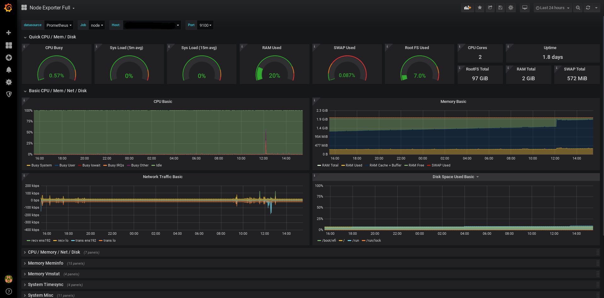

# 🎯 Node Monitoring Stack

A ready-to-use monitoring solution that combines Prometheus, Grafana, and Node Exporter to provide comprehensive system metrics visualization for Linux-based systems.



## 📊 Stack Components

- **Prometheus** - Collects and stores metrics
- **Grafana** - Visualizes metrics with pre-configured dashboards
- **Node Exporter** - Harvests system-level metrics from your Linux host

## 🚀 Quick Start

1. Clone this repository:
   ```bash
   git clone <your-repository-url>
   cd <repository-name>
   ```

2. Create a `.env` file in the root directory with the following variables:
   ```env
   PROMETHEUS_CONTAINER=prometheus-container
   PROMETHEUS_PORT=9090
   NODE_EXPORTER_CONTAINER=node-exporter-container
   NODE_EXPORTER_PORT=9100
   GRAFANA_CONTAINER=grafana-container
   GRAFANA_PORT=3000
   ```

3. Start the monitoring stack:
   ```bash
   docker compose up -d
   ```

4. Access the services:
   - Grafana: `http://localhost:3000`
   - Prometheus: `http://localhost:9090`

## 📈 What's Included

- **Automated Setup**: Pre-configured dashboards and data sources
- **Persistent Storage**: Volume management for Prometheus and Grafana data
- **Secure Defaults**: Read-only access to system metrics
- **Auto-restart**: Services automatically restart on failure

## 🔧 Configuration Files

- `docker-compose.yml` - Main stack configuration
- `config/`
  - `prometheus.yml` - Prometheus scraping configuration
  - `datasources.yml` - Grafana data source configuration
  - `dashboard.yml` - Grafana dashboard provider settings
  - `dashboard.json` - Pre-configured Node Exporter dashboard

## 📝 Default Ports

| Service       | Port  |
|--------------|-------|
| Grafana      | 3000  |
| Prometheus   | 9090  |
| Node Exporter| 9100  |

## 🛠️ Customization

You can modify the configuration files in the `config/` directory to:
- Adjust scraping intervals in `prometheus.yml`
- Add new data sources in `datasources.yml`
- Modify dashboard settings in `dashboard.yml`

## 🔒 Security Note

Node Exporter mounts several system directories in read-only mode to collect metrics. Review the volume mounts in `docker-compose.yml` if you need to restrict access further.

## 📚 Additional Resources

- [Prometheus Documentation](https://prometheus.io/docs/introduction/overview/)
- [Grafana Documentation](https://grafana.com/docs/)
- [Node Exporter Documentation](https://prometheus.io/docs/guides/node-exporter/)
